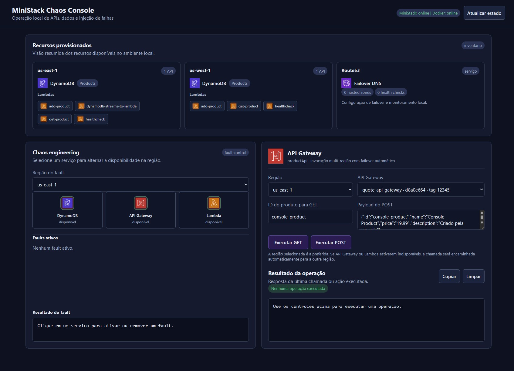

# Chaos Testing a Serverless App com MiniStack

| Chave        | Valor                                                                            |
|--------------|----------------------------------------------------------------------------------|
| Emulador AWS | [MiniStack](https://ministack.org/) — MIT License, gratuito, sem conta           |
| Chaos Bridge | Serviço Python próprio (`chaos-bridge/`) — injeção de falhas via Docker SDK     |
| Serviços AWS | API Gateway v1, Lambda (Java 17), DynamoDB, DynamoDB Streams, SNS, SQS, Route53 |
| Nível        | Avançado                                                                         |
| Use Case     | Chaos Engineering, Serverless, Multi-Region, Failover                            |

---



## O que é este laboratório

Este laboratório demonstra **chaos engineering em uma aplicação serverless multi-região** usando exclusivamente ferramentas gratuitas e open-source.

Você aprenderá a:
- Provisionar uma stack serverless completa (API Gateway + Lambda + DynamoDB) em duas regiões AWS simuladas localmente
- Injetar falhas de serviço (DynamoDB outage, falha de API Gateway) via API
- Observar o comportamento resiliente da aplicação durante outages (buffer via SNS/SQS)
- Configurar Route53 failover automático e verificar a troca de região via SDK

Tudo roda no seu laptop — sem conta AWS, sem cartão de crédito, sem licença.

## Alterações em relação ao repositório original

Este repositório é uma adaptação local do exemplo
[localstack-samples/sample-chaos-serverless-multi-region-failover](https://github.com/localstack-samples/sample-chaos-serverless-multi-region-failover).
As principais diferenças são:

- O MiniStack substitui o LocalStack original e roda sem `LOCALSTACK_AUTH_TOKEN`.
- Os hooks usam `/etc/localstack/init/ready.d/`, caminho reconhecido pela imagem atual.
- O healthcheck do MiniStack usa Python em vez de `curl`, que não está disponível nessa imagem.
- O `chaos-bridge` fornece o proxy `http://localhost:4567/dynamodb`. Durante um fault, somente as chamadas DynamoDB recebem `503`; o MiniStack permanece ativo.
- As Lambdas Java usam `AWS_DYNAMODB_ENDPOINT` para acessar o proxy, enquanto os demais serviços continuam no MiniStack.
- O endpoint lógico `http://localhost:4567/failover/product` simula o roteamento de failover: tenta a região preferida e ignora regiões com fault de API Gateway ou Lambda.
- O failover Route53 é validado pela API e pelo estado do `chaos-bridge`, pois o MiniStack não fornece DNS real nem status nativo de health checks.
- Os testes descobrem o ID interno real da API Gateway pela tag `_custom_id_`, em vez de assumir que `12345` e `67890` sejam IDs de execução.

Para executar a versão adaptada:

```bash
make check
make install
make start
make ready
make deploy
make test
```

O fluxo foi validado localmente com os quatro testes de integração passando.

---

## Arquitetura

```
┌─────────────────────────────────────────────────────────────────┐
│                         Host (localhost)                        │
│                                                                 │
│  ┌──────────────┐    POST /_chaos/faults    ┌───────────────┐  │
│  │  Testes /    │ ─────────────────────────▶│  chaos-bridge │  │
│  │  Scripts     │       porta 4567          │   (porta 4567)│  │
│  └──────────────┘                           └───────┬───────┘  │
│                                                     │           │
│         AWS CLI / boto3                      DynamoDB proxy     │
│         --endpoint-url                       (fault isolado)   │
│         http://localhost:4566                       │           │
│              │                                      │           │
│              ▼                                      ▼           │
│  ┌────────────────────────────────────────────────────────────┐ │
│  │           MiniStack (ministackorg/ministack)               │ │
│  │          porta 4566 — todos os serviços AWS               │ │
│  │  API GW │ Lambda │ DynamoDB │ SNS │ SQS │ Route53         │ │
│  └────────────────────────────────────────────────────────────┘ │
└─────────────────────────────────────────────────────────────────┘
```

**Região primária (us-east-1):**
- API Gateway v1 com endpoints `/productApi` e `/healthcheck`
- Lambdas Java 17: `add-product`, `get-product`, `healthcheck`
- Tabela DynamoDB `Products` com Streams habilitados
- SNS Topic + SQS Queue para bufferizar requisições durante outages

**Região secundária (us-west-1):**
- Stack idêntico para failover automático
- DynamoDB sincronizado via Streams + Lambda de replicação

**chaos-bridge (porta 4567):**
- `POST /_chaos/faults`   — injeta falha de serviço
- `GET /_chaos/faults`    — lista faults ativos
- `DELETE /_chaos/faults` — remove faults
- `POST /dynamodb`        — proxy interno usado pelas Lambdas Java
- `GET|POST /failover/product` — encaminha `productApi` para a primeira região saudável
- `dynamodb` fault → retorna indisponibilidade somente para chamadas DynamoDB
- `apigateway`/`lambda` fault → força status Unhealthy nos health checks do Route53

---

## Componentes

### `chaos-bridge/`

Serviço FastAPI que implementa a API de injeção de falhas deste laboratório.
Traduz chamadas REST para faults isolados, encaminha as chamadas DynamoDB ao
MiniStack e atualiza manualmente o status dos health checks do Route53 — necessário porque
o MiniStack não executa health checks reais por padrão
(ver [limitações conhecidas](https://ministack.org/docs/limitations)).

```bash
# Ver faults ativos
curl http://localhost:4567/_chaos/faults

# Injetar falha DynamoDB
curl -X POST http://localhost:4567/_chaos/faults \
  -H 'Content-Type: application/json' \
  -d '[{"service": "dynamodb", "region": "us-east-1"}]'

# Limpar todos os faults
curl -X DELETE http://localhost:4567/_chaos/faults \
  -H 'Content-Type: application/json' \
  -d '[]'

# Diagnóstico
curl http://localhost:4567/_chaos_bridge/health
curl http://localhost:4567/_chaos_bridge/containers
```

### `init-resources.sh`

Script de provisionamento executado automaticamente pelo hook
`/etc/localstack/init/ready.d/` quando o MiniStack inicia.
Cria todas as tabelas DynamoDB, funções Lambda, APIs e rotas nas duas regiões.

### `solutions/dynamodb-outage.sh`

Provisiona SNS Topic, SQS Queue e Lambda de processamento assíncrono para o
cenário de outage do DynamoDB.

### `solutions/route53-failover.sh`

Provisiona hosted zone, health check, CNAME records e failover alias records
para o cenário de failover multi-região.

---

## Pré-requisitos

- [Docker](https://docs.docker.com/get-docker/) e [Docker Compose](https://docs.docker.com/compose/install/)
- [AWS CLI](https://docs.aws.amazon.com/cli/latest/userguide/install-cliv2.html)
- [Maven 3.8.5+](https://maven.apache.org/install.html) e [Java 17](https://www.java.com/en/download/)
- [Python 3.11+](https://www.python.org/downloads/)
- [`make`](https://www.gnu.org/software/make/)

Não é necessário nenhuma conta em nuvem, chave de API ou licença de software.

---

## Instalação

```bash
git clone git@github.com:emcostadev/sample-chaos-serverless-multi-region-failover.git
cd samples-chaos-serverless-multi-region-failover

# Verifica pré-requisitos
make check

# Compila as Lambdas Java e instala dependências Python
make install
```

---

## Subindo o ambiente

```bash
# Sobe MiniStack + chaos-bridge
make start

# Aguarda tudo ficar pronto
make ready
```

O `init-resources.sh` roda dentro do container MiniStack assim que ele fica pronto
e provisiona toda a infraestrutura automaticamente.

Para provisionar os cenários de chaos engineering (SNS/SQS e Route53):

```bash
make deploy
```

---

## Testando manualmente

### Console web local

Depois de executar `make start`, abra:

```text
http://localhost:4567/console
```
A console é servida pelo `chaos-bridge` e não exige Node.js, npm ou outro
frontend. Ela permite visualizar os recursos provisionados, executar chamadas
no `productApi` com failover automático e ativar ou desativar faults de
DynamoDB, API Gateway e Lambda por região.

#### Como utilizar a console

1. Inicie o ambiente e aguarde o provisionamento:

   ```bash
   make start
   make ready
   make deploy
   ```

2. Acesse [http://localhost:4567/console](http://localhost:4567/console).

3. No painel **Recursos provisionados**, confira as APIs, Lambdas, tabelas e
   regiões disponíveis. Os IDs exibidos são os IDs internos descobertos no
   MiniStack.

4. No painel **API Gateway**, escolha `GET` ou `POST`:
   - `GET` usa o campo de consulta `id`;
   - `POST` usa os campos JSON do produto;
   - a região preferida é tentada primeiro;
   - se houver fault ou erro transitório, o endpoint tenta a outra região;
   - a resposta informa a região que atendeu a chamada.

5. No painel **Chaos Engineering**, selecione uma região e clique no ícone do
   serviço para alternar o fault:
   - verde: serviço disponível;
   - vermelho: fault ativo;
   - DynamoDB afeta somente as operações do DynamoDB naquela região;
   - API Gateway e Lambda tornam a região inelegível para o failover lógico.

6. Execute novamente a operação no painel **API Gateway** e observe o resultado
   e a região atendente. Os faults ativos e o resultado da ativação aparecem no
   painel **Chaos Engineering**.

Para acompanhar o mesmo estado pelo terminal:

```bash
# Faults ativos
curl http://localhost:4567/_chaos/faults

# Estado do ambiente
curl http://localhost:4567/_chaos_bridge/health

# Chamada GET com failover lógico
curl 'http://localhost:4567/failover/product?preferred_region=us-east-1&id=prod-1'
```

### Operação normal

```bash
# Descobrir o ID interno real da API primária.
# 12345 é apenas a tag _custom_id_, não o ID usado na URL.
PRIMARY_API_ID=$(aws --endpoint-url http://localhost:4566 apigateway get-rest-apis \
  --region us-east-1 \
  --query "items[?tags._custom_id_=='12345'].id | [0]" \
  --output text)

# Criar produto
curl -X POST "http://localhost:4566/restapis/${PRIMARY_API_ID}/dev/_user_request_/productApi" \
  -H 'Content-Type: application/json' \
  -d '{"id": "prod-1", "name": "Produto Teste", "price": "29.99", "description": "Teste"}'
# Resposta esperada: Product added/updated successfully.

# Buscar produto
curl "http://localhost:4566/restapis/${PRIMARY_API_ID}/dev/_user_request_/productApi?id=prod-1"
```

### Cenário 1 — DynamoDB Outage

```bash
# 1. Injetar falha no DynamoDB
make chaos-inject SERVICE=dynamodb REGION=us-east-1

# 2. Tentar criar produto durante a falha
curl -X POST "http://localhost:4566/restapis/${PRIMARY_API_ID}/dev/_user_request_/productApi" \
  -H 'Content-Type: application/json' \
  -d '{"id": "prod-outage", "name": "Produto Outage", "price": "0.00", "description": "Durante falha"}'
# Resposta esperada: A DynamoDB error occurred. Message sent to queue.

# 3. Remover a falha
make chaos-clear

# 4. Verificar que o produto foi processado pela Lambda de recuperação
aws --endpoint-url http://localhost:4566 dynamodb scan --table-name Products --region us-east-1
```

### Cenário 2 — Route53 Failover

```bash
# 1. Verificar estado inicial do failover
HOSTED_ZONE_ID=$(aws --endpoint-url http://localhost:4566 route53 list-hosted-zones \
  --query "HostedZones[?Name=='hello-ministack.local.'].Id | [0]" \
  --output text | sed 's|/hostedzone/||')
aws --endpoint-url http://localhost:4566 route53 list-resource-record-sets \
  --hosted-zone-id "$HOSTED_ZONE_ID"

# 2. Injetar falhas na região primária
curl -X POST http://localhost:4567/_chaos/faults \
  -H 'Content-Type: application/json' \
  -d '[{"service": "apigateway", "region": "us-east-1"}, {"service": "lambda", "region": "us-east-1"}]'

# 3. Aguardar e verificar failover para us-west-1
sleep 35
# O MiniStack mantém os dois record sets como configuração. A troca do
# registro ativo não é executada nativamente; confirme o fault simulado:
curl http://localhost:4567/_chaos/faults
aws --endpoint-url http://localhost:4566 route53 list-resource-record-sets \
  --hosted-zone-id "$HOSTED_ZONE_ID"

# 4. Remover falhas e verificar failback
make chaos-clear
sleep 35
# A ausência de faults confirma o failback simulado:
curl http://localhost:4567/_chaos/faults
aws --endpoint-url http://localhost:4566 route53 list-resource-record-sets \
  --hosted-zone-id "$HOSTED_ZONE_ID"
```

### Endpoint lógico de failover

Como o MiniStack não fornece DNS real, o `chaos-bridge` também expõe um
endpoint lógico para testar o redirecionamento entre regiões:

```bash
# A região preferida é tentada primeiro.
curl -X POST http://localhost:4567/failover/product \
  -H 'Content-Type: application/json' \
  -d '{
    "preferred_region": "us-east-1",
    "payload": {
      "id": "prod-failover",
      "name": "Produto Failover",
      "price": "39.99",
      "description": "Criado pelo endpoint lógico"
    }
  }'

# Para GET, os parâmetros podem ser enviados diretamente na query string.
curl 'http://localhost:4567/failover/product?preferred_region=us-east-1&id=prod-failover'
```

Quando a região preferida tiver fault de `apigateway` ou `lambda`, ela será
ignorada e a chamada seguirá para a próxima região. A resposta inclui os
headers `X-Failover-Region` e `X-Failover-Api-Id`. Se as duas regiões estiverem
indisponíveis, o endpoint retorna `503`. Cada região recebe até duas tentativas,
com timeout de conexão de 3 segundos e leitura de 8 segundos, para evitar
falhas transitórias de cold start sem bloquear indefinidamente o failover.

---

## Testes automatizados

```bash
make test
```

### Destruir e limpar o ambiente

Quando for necessário recriar o laboratório do zero, use o alvo destrutivo
abaixo. Ele remove os containers do Compose, containers temporários das
Lambdas, volumes associados e o estado persistido do MiniStack em `./volume`,
incluindo os recursos provisionados:

```bash
make destroy CONFIRM=destroy
```

O parâmetro `CONFIRM=destroy` é obrigatório para evitar uma remoção acidental.
Esse comando não remove imagens Docker, os artefatos compilados das Lambdas
nem arquivos do repositório fora de `./volume`.

Variáveis de ambiente usadas pelos testes:

| Variável | Padrão | Descrição |
|---|---|---|
| `AWS_ENDPOINT_URL` | `http://localhost:4566` | Endpoint do MiniStack |
| `CHAOS_ENDPOINT` | `http://localhost:4567` | Endpoint do chaos-bridge |

---

## Limitações conhecidas

| Funcionalidade | Comportamento |
|---|---|
| Health checks de Route53 | O MiniStack não os executa automaticamente. O chaos-bridge força o status via API interna. |
| Resolução DNS real | O MiniStack não expõe servidor DNS na porta 53. Verificar failover via `route53 list-resource-record-sets`. |
| `{id}.execute-api.ministack.local` | FQDNs usados apenas como identificadores nos registros Route53. Acesso real usa path-style: `localhost:4566/restapis/{id}/...` |
| Granularidade de chaos | Falhas de DynamoDB são aplicadas pelo proxy sem pausar o container MiniStack. O proxy identifica a região pela assinatura AWS SigV4. |

---

## Troubleshooting

| Problema | Solução |
|---|---|
| `chaos-bridge` não inicia | Verifique se `/var/run/docker.sock` está montado e o usuário tem permissão |
| Proxy DynamoDB não responde | `curl http://localhost:4567/_chaos_bridge/health` para diagnóstico e verifique `AWS_DYNAMODB_ENDPOINT=http://chaos-bridge:4567/dynamodb` |
| Lambda não conecta ao DynamoDB | Verifique `AWS_ENDPOINT_HOST=ministack` e `AWS_DYNAMODB_ENDPOINT` no `init-resources.sh` |
| `init-resources.sh` falha durante o startup | O hook não depende mais de `jq` nem de acesso externo para fazer parsing; verifique os logs com `docker compose logs ministack` e confirme que os artefatos Java foram compilados com `make install` |
| Testes de failover falham | O MiniStack não executa health checks reais. O `test_failover.py` usa verificação via SDK (não dig/DNS). Confirme que o chaos-bridge está rodando. |

---

## Referências

- [MiniStack Documentation](https://ministack.org/docs/)
- [MiniStack Known Limitations](https://ministack.org/docs/limitations)
- [Route53 Health Checks and Failover — AWS Docs](https://docs.aws.amazon.com/Route53/latest/DeveloperGuide/dns-failover.html)
- [Chaos Engineering Principles](https://principlesofchaos.org/)
- [Docker SDK for Python](https://docker-py.readthedocs.io/)
- [FastAPI](https://fastapi.tiangolo.com/)
